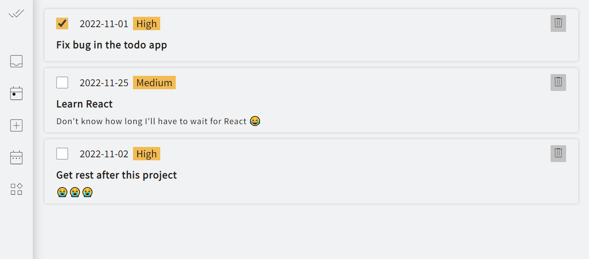
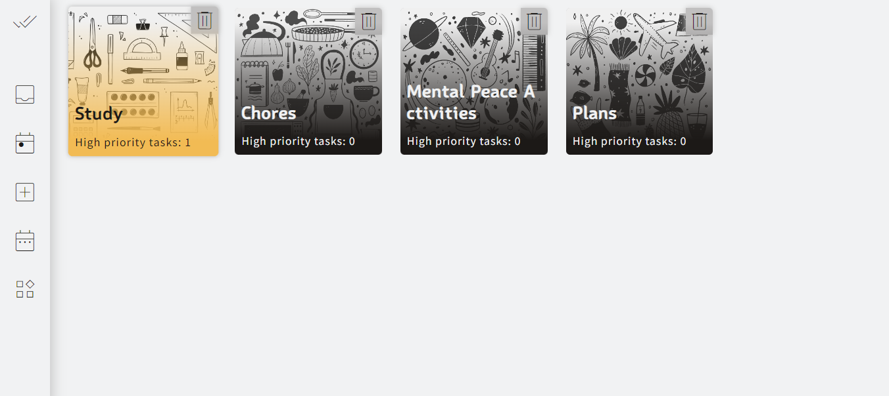

# Todo List

Todo List built with HTML, CSS, Javascript, Webpack and date-fns, uuid libraries for TheOdinProject

## Features

- **Prioritization** 
  &nbsp;&nbsp; Add priority labels to todos and easily recognize important todos

- **Projects** 
  &nbsp;&nbsp; Create projects to keep related todos together 

- **Project Background** 
  &nbsp;&nbsp; Choose a background image you like for your project 

- **High Priority Tasks Count** 
  &nbsp;&nbsp; Easily identify projects with more number of high priority todos 

- **Simple UI** 
  &nbsp;&nbsp; A simple, easy-to-use yet modern UI 

## Roadmap

- Display a background image along with a message when there's no todo/project to display
- Display message when the required input fields are empty
- Sorting functionality to allow users to sort the todos according to the priority
- Reordering todos functionality to allow users to reorder the todos
- Dark mode

## Known Issues

- Duplicate project titles cause confusion and inconvenience

## Learnings

- new array method: flat()
- got familiar with date-fns and uuid libraries
- event propagation (ended up not using e.stopPropagation() though!!)
- first time used a data attribute 😅 and that too setting it with javascript.
- e.currentTarget (It always refers to the element to which the event handler has been attached, as opposed to e.target, which identifies the element on which the event occurred and which may be its descendant)
- adding tooltips
- strengthen my grid skills

## Preview

### Todo

### Projects

## Demo

👉 [Live Demo](https://ruchita1010.github.io/todo-list)
